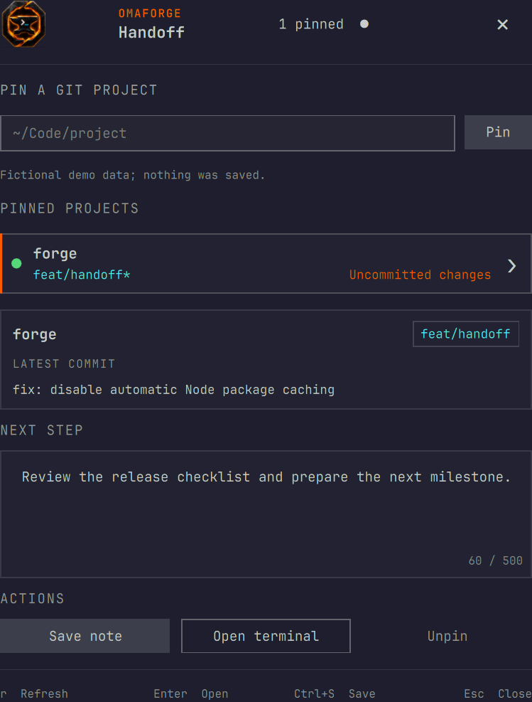

# Handoff

Pick up Git projects where you left off.

Handoff is a local-first Omarchy bar widget for remembering where you stopped
across Git projects. It saves one clear next step alongside the current Git
context and reopens the project in a terminal when you are ready to continue.
It is the flagship reference plugin built with Omarchy Forge.

Handoff is an independent community project. It is not affiliated with or
endorsed by Omarchy, Basecamp, 37signals, or DHH.



## MVP features

- Add a project by entering its local directory.
- Save one next-step note per project.
- Show the branch, clean/dirty state, latest commit subject, and check time.
- Open the selected project in the configured terminal.
- Persist data atomically under
  `$XDG_DATA_HOME/omarchy-handoff/state.json` (or
  `~/.local/share/omarchy-handoff/state.json`).
- Refresh entirely through local, argument-safe Git commands.

Handoff has no server, account, API key, telemetry, analytics, or required
network access. It does not modify project files or Omarchy's `shell.json`.

Version `0.2.0` is the current reviewed release line. Repository tags and
GitHub releases are the authoritative record of availability. Handoff is
published by the Omarchy Forge organization as an owner-built reference
project; it is not an official Omarchy plugin.

## Requirements

- Omarchy 4 with manifest schema 1 and Quickshell plugin support.
- Git.
- `xdg-terminal-exec`, supplied by the verified Omarchy environment.

## Configuration

The bar-widget setting **Show uncommitted-change status** controls whether the
clean/dirty label is shown. Project paths and notes are managed inside Handoff
and remain in its XDG data file rather than Omarchy configuration.

## Install

Plugins execute unsandboxed inside the long-lived Omarchy Shell process. Review
and trust the source before enabling it.

```bash
omarchy plugin add https://github.com/omarchy-forge/handoff.git --enable
```

For development from a reviewed local checkout, use
`omarchy plugin add "$PWD" --enable` from the repository root instead.

## Use

1. Open Handoff from the bar.
2. Enter an absolute project path or a path beginning with `~/`, then select
   **Add project**. Handoff records the project locally; it does not modify Git.
3. Select a saved project and write its next step.
4. Select **Save note** or **Open terminal**.

Right-click the bar icon or press `R` while the panel is focused to refresh Git
metadata. Press `Enter` to open the selected project and `Esc` to close.

Removing a project deletes only Handoff's record. It never deletes or edits the
project or changes the Git repository.

## Development

```bash
./tests/run
./demo/run ready
./demo/run empty
./demo/run error
omaforge dev . --trust-plugin-code --state ready
omaforge dev . --trust-plugin-code --state ready --watch
omaforge screenshot . --trust-plugin-code --state ready --output /tmp/handoff-preview.png
./scripts/release-check 0.2.0
```

The demo uses fictional in-memory records through shell IPC. It does not write
Handoff data, restart the shell, or alter Omarchy configuration.

The preview uses fictional in-memory data captured during a reviewed visual
session on Omarchy 4. No project note or path from the user's saved state is
shown.

Forge `v0.2.0` development commands run Handoff in a temporary HOME/XDG
environment without installing it or connecting to the live shell. Screenshot
output contains only the declared panel content and refuses existing paths.
Private CI uses the public Forge `v0.2.0` Action for deterministic static checks
but never executes the runtime harness or plugin QML.

## Update

For a Git-managed installation:

```bash
omarchy plugin update omaforge.handoff
```

## Removal

```bash
omarchy plugin remove omaforge.handoff
```

Removing the plugin does not automatically delete its local state file. After
reviewing its contents, remove `$XDG_DATA_HOME/omarchy-handoff/` manually if the
saved notes are no longer needed.

## Privacy and security

Handoff stores the local project path, note, branch, dirty-state flag, commit
metadata, and timestamps. Notes may be sensitive; the state file remains local
and is created using the user's normal permissions. Do not place credentials or
secrets in notes.

Git and terminal commands use argument arrays rather than interpolated shell
commands. Handoff disables Git hooks and filesystem monitors for metadata
inspection; it never executes project code, build scripts, or QML. Normal use
performs no network request, even when a Git remote exists.

See [SECURITY.md](SECURITY.md) for reporting and trust boundaries.

## License

MIT © Omarchy Forge contributors
